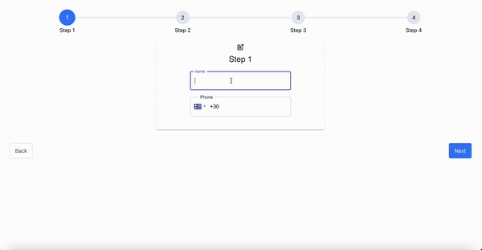

# progress_signup_form

This is a simple signup form with React and Redux with css that make it looks nice.
Includes stron validate of any different case for each field.

Anyone can use it to connect with the backend and make it work for an actual purpose.
Check the following gif.

